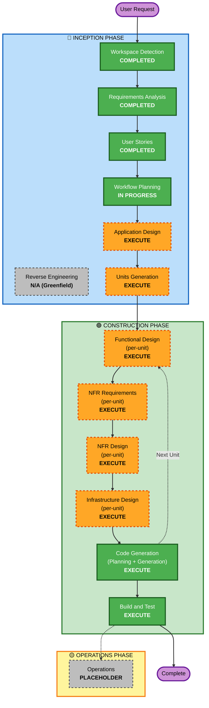

# 実行計画 (Execution Plan)

**プロジェクト**: AI Task Manager
**作成日**: 2026-04-17
**プロジェクトタイプ**: Greenfield

---

## 1. 詳細分析サマリー

### 1.1 変更影響アセスメント (Change Impact Assessment)

| 影響領域 | 該当 | 内容 |
|---|---|---|
| ユーザー向けの変更 | ✅ Yes | Web UI(Next.js / カンバンボード)、AI 実行進捗 UI、監査ログ UI を新規構築 |
| 構造的変更 | ✅ Yes | マイクロサービス構成を新規構築(FE + Go BE + Python AI サービス + GitHub App) |
| データモデル変更 | ✅ Yes | PostgreSQL スキーマ(tasks, subtasks, tags, repositories, ai_runs, audit_logs など)を新規設計 |
| API 変更 | ✅ Yes | REST/RPC API を新規定義、GitHub Webhook エンドポイント、Pub/Sub ハンドラを新設 |
| NFR への影響 | ✅ Yes | パフォーマンス(p95<200ms, スケール数千 UU)、セキュリティ(HTTPS、Secret Manager、サンドボックス)、テスタビリティ(PBT、80% カバレッジ)を満たす必要あり |

### 1.2 リスクアセスメント (Risk Assessment)

| 項目 | 評価 | 根拠 |
|---|---|---|
| **リスクレベル** | **High** | Greenfield で 4 層(FE/BE/AI/Infra)を同時構築、AI 自律動作の安全性、GitHub App の権限管理、コスト制御の不確実性 |
| ロールバック複雑度 | Moderate | Cloud Run のリビジョン戻し・Terraform の状態管理で対応可能、ただし DB マイグレーションは慎重対応 |
| テスト複雑度 | Complex | PBT + 統合テスト(Testcontainers)+ GitHub App モック + LLM モックが必要 |

### 1.3 コンポーネント影響(新規作成)

| コンポーネント | 種別 | 主な責務 |
|---|---|---|
| Web Frontend | 新規 | Next.js + カンバン UI + **アイデア対話 UI / タスク提案プレビュー** + AI 実行進捗 + 監査ログ表示 |
| Core API (Go) | 新規 | タスク CRUD、**対話セッション管理 / ドラフトタスク永続化**、認証(抽象層)、GitHub 連携、AI 実行オーケストレーション |
| AI Agent Service (Python) | 新規 | Claude Agent SDK による **アイデア対話・深掘り質問生成・タスク提案生成**、Issue/PR 生成、リスク評価サブエージェント |
| Data Layer | 新規 | Cloud SQL (PostgreSQL)、Memorystore (Redis)、Cloud Storage |
| GitHub App | 新規 | Webhook 受信、API 操作、権限管理 |
| Infrastructure (Terraform) | 新規 | GCP リソース(Cloud Run, Cloud SQL, Pub/Sub, Secret Manager, Cloud Monitoring)+ Vercel プロジェクト |
| CI/CD Pipeline | 新規 | GitHub Actions、PBT/Security スキャン、デプロイ自動化 |

---

## 2. ワークフロー可視化 (Workflow Visualization)

---

## 3. 実行フェーズ詳細 (Phases to Execute)

### 🔵 INCEPTION PHASE

- [x] **Workspace Detection** (COMPLETED)
- [x] **Reverse Engineering** (N/A — Greenfield)
- [x] **Requirements Analysis** (COMPLETED)
- [x] **User Stories** (COMPLETED)
- [x] **Workflow Planning** (IN PROGRESS)
- [ ] **Application Design** — **EXECUTE**
  - **Rationale**: 新規コンポーネント(FE、Go BE、Python AI サービス、GitHub App)の高レベル設計が必要。コンポーネント間の責務分担・API 契約・サービス層設計を Units 分解前に確定させる。深度: Standard(新規構築だが基本的な Web + AI サービスのアーキテクチャ)
- [ ] **Units Generation** — **EXECUTE**
  - **Rationale**: 複数サービス・複数リポジトリ・IaC を含むため、作業単位への分解が必須。並列開発や per-unit の設計実施に必要。深度: Standard

### 🟢 CONSTRUCTION PHASE (per-unit loop)

- [ ] **Functional Design** (per-unit) — **EXECUTE**
  - **Rationale**: 各ユニット(特に Task Domain / AI Agent Service / Risk Assessment)で新規データモデル・ビジネスルールの設計が必要。リスク判定の境界値・自動マージポリシーは Functional Design で確定
- [ ] **NFR Requirements** (per-unit) — **EXECUTE**
  - **Rationale**: パフォーマンス(p95<200ms、スケール数千 UU)、セキュリティ(Extension 強制)、テスタビリティ(PBT 強制、80% カバレッジ)の NFR をユニットごとに割り当て
- [ ] **NFR Design** (per-unit) — **EXECUTE**
  - **Rationale**: NFR Requirements を受け、パターン(サーキットブレーカ、レート制限、PII フィルタ、サンドボックス)を具体的な設計に落とし込む
- [ ] **Infrastructure Design** (per-unit) — **EXECUTE**
  - **Rationale**: GCP サービス(Cloud Run, Cloud SQL, Secret Manager, Pub/Sub, Cloud Monitoring)+ Vercel を Terraform で IaC 化する設計が必要
- [ ] **Code Generation** (per-unit, Planning + Generation) — **EXECUTE (ALWAYS)**
  - **Rationale**: 各ユニットの実装を Planning → Generation で段階的に実施
- [ ] **Build and Test** — **EXECUTE (ALWAYS)**
  - **Rationale**: 全ユニットのビルド、ユニット/統合/PBT/セキュリティスキャン/E2E テストの手順生成

### 🟡 OPERATIONS PHASE

- [ ] **Operations** — **PLACEHOLDER**
  - **Rationale**: 現在はプレースホルダー。将来的にデプロイメント/監視/インシデント対応ワークフローを追加

---

## 4. スキップされるステージ (Stages to Skip)

| ステージ | ステータス | 理由 |
|---|---|---|
| Reverse Engineering | SKIP (N/A) | Greenfield プロジェクトのため既存コードなし |

すべての条件付きステージは実行対象です(本プロジェクトは High リスク・Complex 複雑度のため)。

---

## 5. 推定タイムライン (Estimated Timeline)

**Phase 別目安**(AI-DLC ワークフロー内での対話ターン数 + 生成物量ベース):

| フェーズ | ステージ | 推定ターン / 作業量 |
|---|---|---|
| INCEPTION 残り | Application Design → Units Generation | 2〜4 ターン |
| CONSTRUCTION(ユニット 1 開始) | Functional + NFR Req + NFR Design + Infra Design + Code Gen | 5〜8 ターン/ユニット |
| CONSTRUCTION ユニット数 | 予想 4〜6 ユニット | 合計 20〜48 ターン |
| Build and Test | 最終ステージ | 2〜3 ターン |
| **合計** | | **30〜60 ターン(ユーザー回答・承認含む)** |

実装工数の目安(別途、人間が手を動かす or AI が実装する場合):
- MVP: **約 6〜12 週間**(1〜2 人月 × 3 名体制想定)
- Phase2(OAuth 認証、レビュー通知拡充など): 追加 4〜6 週間

---

## 6. 成功基準 (Success Criteria)

### 主目的
**ユーザーが GUI でタスクを作成すると、AI エージェントが対応する GitHub Issue を自動作成し、実装 → PR 作成 → リスク判定に基づいて自動マージまたはレビュアーアサインを行う MVP を稼働させる。**

### 主要成果物
- [x] 要件ドキュメント `requirements.md`(承認済)
- [x] ペルソナ `personas.md` / ユーザーストーリー `stories.md`(承認済)
- [ ] アプリケーション設計ドキュメント(コンポーネント・責務・契約)
- [ ] ユニット定義(作業単位の一覧・依存関係)
- [ ] ユニットごとの Functional / NFR / Infrastructure 設計
- [ ] ユニットごとのコード(Go BE / Python AI / Next.js FE / Terraform / GitHub App 設定)
- [ ] テストスイート(Unit / Integration / PBT / Security / E2E)
- [ ] ビルド・テスト手順書
- [ ] 監査ログ `audit.md`(全フェーズの意思決定記録)

### 品質ゲート
- ✅ Security Baseline 拡張機能のすべての適用ルールに適合
- ✅ Property-Based Testing 拡張機能のすべての適用ルールに適合
- ✅ 全要件 FR/NFR がユーザーストーリーとコードへトレース可能
- ✅ 各ステージで明示的なユーザー承認を経ている
- ✅ 全ユニットのテストが通過する
- ✅ p95 API レイテンシが 200ms 以下を達成

---

## 7. 主要リスクと緩和策 (Key Risks & Mitigations)

| # | リスク | 緩和策 |
|---|---|---|
| R1 | AI 自律マージによる意図しない変更 | リスク評価エージェントによる 3 段階分類、サンドボックス実行、監査ログ、緊急停止スイッチ |
| R2 | GitHub App 権限の過大付与 | インストール時にスコープ最小化(Issues/PR/Contents のみ)、ユーザー設定で追加同意 |
| R3 | Claude API コストの予測不能 | タスク毎予算上限、月次上限、トークン課金アラート、Haiku / Sonnet / Opus の用途別振り分け |
| R4 | Cloud SQL のコスト・スケール | MVP は最小インスタンス、Phase2 で Read Replica、必要に応じてキャッシュ |
| R5 | ベンダーロックイン(Firebase Auth + GCP) | 認証は抽象インターフェース、インフラは Terraform で別クラウドへ移植余地を残す |

---

## 8. 次のアクション

承認いただければ、次は **Application Design ステージ** に進みます。そこでは以下を実施します:

- コンポーネント分解と各コンポーネントの責務定義
- コンポーネント間の契約(API、メッセージ、データ形式)
- サービス層のインターフェース
- エラー処理・再試行・イベント駆動パターンの基本方針
